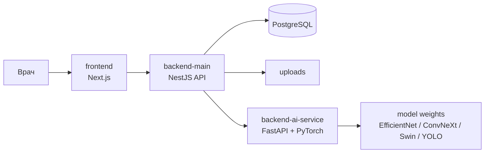

# MedAI Diagnostics

Веб-приложение для поддержки диагностики глазных заболеваний по снимкам глазного дна. Система помогает врачу загрузить fundus-снимок, получить предварительный результат ИИ, посмотреть вероятности по классам ODIR, визуальные слои интерпретации и сформировать врачебное заключение.

Проект состоит из трех независимых репозиториев, которые вместе образуют одну систему:

- `frontend` - клиентское приложение на Next.js и TypeScript.
- `backend-main` - основной API на NestJS, PostgreSQL и TypeORM.
- `backend-ai-service` - ML-сервис на FastAPI и PyTorch.

> Результаты ИИ являются вспомогательным инструментом и не заменяют клиническое решение врача.

## Возможности

- Загрузка снимков глазного дна через веб-интерфейс.
- Ведение списка исследований и карточек пациентов.
- Повторные исследования для одного пациента.
- Отдельное хранение жалоб, анамнеза и служебных заметок.
- Сравнение снимков пациента, включая левый и правый глаз.
- Просмотр изображения с масштабированием и перемещением.
- Отображение вероятностей по классам ODIR:
  `N, D, G, C, A, H, M, O`.
- Выделение классов выше пороговых значений.
- Grad-CAM карта внимания для интерпретации классификации.
- YOLO-детекция локальных признаков диабетической ретинопатии.
- Врачебное решение: подтвердить, отклонить или отправить на осмотр.
- Формирование PDF-отчета по исследованию.
- Авторизация через HttpOnly cookies.
- Rate limiting для защиты чувствительных API-операций.

## Архитектура



Основной поток обработки:

1. Врач загружает снимок во frontend.
2. Frontend отправляет multipart-запрос в `backend-main`.
3. NestJS сохраняет исследование и пересылает изображение в ML-сервис.
4. FastAPI выполняет классификацию, Grad-CAM и YOLO-детекцию.
5. NestJS нормализует ответ, сохраняет диагноз и возвращает результат frontend.
6. Врач просматривает результат, принимает решение и при необходимости скачивает PDF-отчет.

## Репозитории

### `frontend`

Клиентское приложение для врача.

Стек:

- Next.js App Router
- TypeScript
- Tailwind CSS
- TanStack Query
- Zod для runtime-валидации API-ответов
- Feature-Sliced Design

Основные страницы:

- `/login`
- `/register`
- `/dashboard`
- `/patients`
- `/patients/[id]`
- `/patients/[id]/compare`
- `/studies/new`
- `/studies/[id]`

### `backend-main`

Основной backend API.

Стек:

- NestJS
- TypeORM
- PostgreSQL
- JWT access/refresh cookies
- Swagger
- PDFKit для отчетов

Основные зоны ответственности:

- авторизация;
- пользователи;
- пациенты;
- исследования;
- диагнозы;
- проксирование изображений в ML-сервис;
- генерация PDF-отчетов;
- хранение загруженных снимков.

### `backend-ai-service`

ML-сервис диагностики.

Стек:

- FastAPI
- PyTorch
- timm
- Pillow
- OpenCV
- Ultralytics YOLO

ML pipeline:

- multi-label classification по ODIR-классам;
- ensemble из трех классификационных моделей;
- усреднение вероятностей;
- применение порогов;
- Grad-CAM;
- YOLO-детекция локальных признаков диабетической ретинопатии.

## ML-модели

Веса моделей должны лежать в:

```text
backend-ai-service/models/
```

Ожидаемые файлы:

```text
efficientnet_b3_best.pt
convnext_tiny_best.pt
swin_tiny_best.pt
yolo_dr_best.pt
```

В Docker эта папка монтируется в контейнер как:

```text
/app/models
```

Также в папке `models/` могут храниться:

```text
ensemble_config.json
thresholds.json
```

Веса моделей не должны попадать в git. Для `.pt`, `.pth`, `.onnx` добавлены правила в `.gitignore`.

## Быстрый запуск

Рекомендуемая локальная структура:

```text
project/
  frontend/
  backend-main/
  backend-ai-service/
```

Это важно, потому что `backend-main/docker-compose.yml` собирает AI-сервис из соседней папки `../backend-ai-service`.

### 1. Подготовить веса моделей

Положите веса в:

```text
backend-ai-service/models/
```

Минимально для классификации нужны три файла:

```text
efficientnet_b3_best.pt
convnext_tiny_best.pt
swin_tiny_best.pt
```

YOLO необязателен для базовой классификации. Если `yolo_dr_best.pt` отсутствует, классификация продолжит работать, а сервис вернет понятную ошибку в поле detection.

### 2. Запустить backend stack

```bash
cd backend-main
cp .env.example .env
docker-compose up --build
```

Сервисы:

- NestJS API: `http://localhost:3000/api/v1`
- Swagger: `http://localhost:3000/api/docs`
- FastAPI docs: `http://localhost:8000/docs`
- PostgreSQL: `127.0.0.1:55432`

pgAdmin запускается отдельным профилем:

```bash
docker-compose --profile tools up pgadmin
```

pgAdmin будет доступен на:

```text
http://localhost:5050
```

### 3. Запустить frontend

```bash
cd frontend
npm install
npm run dev
```

Frontend по умолчанию запускается на:

```text
http://localhost:3001
```

## Запуск без Docker

### Backend API

```bash
cd backend-main
npm install
npm run start:dev
```

Нужен доступный PostgreSQL и корректный `.env`.

### ML service

```bash
cd backend-ai-service
pip install -r requirements.txt
uvicorn app.main:app --reload --port 8000
```

### Frontend

```bash
cd frontend
npm install
npm run dev
```

## Переменные окружения

Основной пример лежит в:

```text
backend-main/.env.example
```

Ключевые переменные:

```env
PORT=3000
CORS_ORIGIN=http://localhost:3001

DB_HOST=localhost
DB_PORT=5432
DB_PUBLISHED_PORT=55432
DB_USERNAME=postgres
DB_PASSWORD=postgres
DB_DATABASE=fundus_db

JWT_ACCESS_SECRET=change-me
JWT_REFRESH_SECRET=change-me
JWT_ACCESS_EXPIRES_IN=15m
JWT_REFRESH_EXPIRES_IN=7d

COOKIE_SECURE=false
COOKIE_SAME_SITE=lax

AI_SERVICE_URL=http://localhost:8000
MAX_FILE_SIZE=10485760
```

Для production обязательно заменить JWT secrets и включить secure cookies:

```env
COOKIE_SECURE=true
COOKIE_SAME_SITE=lax
TRUST_PROXY=true
```

## API

Backend использует глобальный префикс:

```text
/api/v1
```

Основные endpoints:

```text
POST   /api/v1/auth/register
POST   /api/v1/auth/login
POST   /api/v1/auth/refresh
GET    /api/v1/auth/me
POST   /api/v1/auth/logout

GET    /api/v1/patients
GET    /api/v1/patients/:id

GET    /api/v1/studies
GET    /api/v1/studies/:id
POST   /api/v1/studies
DELETE /api/v1/studies/:id
GET    /api/v1/studies/:id/image
GET    /api/v1/studies/:id/report.pdf

GET    /api/v1/diagnoses
GET    /api/v1/diagnoses/:id
PATCH  /api/v1/diagnoses/:id
DELETE /api/v1/diagnoses/:id

POST   /api/v1/diagnosis/analyze
GET    /api/v1/health
```

ML service:

```text
POST /predict
GET  /health
```

## Формат ответа ML-сервиса

Упрощенный пример:

```json
{
  "classification": {
    "labels": [
      {
        "code": "D",
        "name": "Diabetes / Diabetic Retinopathy",
        "probability": 0.82,
        "threshold": 0.35,
        "is_positive": true
      }
    ],
    "predicted_labels": ["D"]
  },
  "ensemble": {
    "method": "simple_average",
    "models": {
      "efficientnet_b3": { "probabilities": {} },
      "convnext_tiny": { "probabilities": {} },
      "swin_tiny": { "probabilities": {} }
    }
  },
  "explainability": {
    "gradcam_base64": "...",
    "target_class": "D",
    "error": null
  },
  "detection": {
    "model": "yolo",
    "boxes": [],
    "error": null
  },
  "image": {
    "width": 1024,
    "height": 768
  }
}
```

## Безопасность

Реализовано:

- access/refresh токены хранятся в HttpOnly cookies;
- refresh token хранится в базе в хешированном виде;
- защищенные маршруты frontend проверяются через Next.js middleware;
- backend защищает API через JWT guards;
- rate limiting для auth и чувствительных операций;
- CORS ограничивается через `CORS_ORIGIN`;
- загруженные файлы валидируются по MIME type и размеру;
- PostgreSQL и ML-сервис в Docker привязаны к `127.0.0.1`, а не публикуются наружу;
- `.env`, uploads, веса моделей и build artifacts исключены из git.

Для публичного production-развертывания рекомендуется:

- открыть наружу только reverse proxy на `80/443`;
- включить HTTPS;
- включить `COOKIE_SECURE=true`;
- использовать отдельные production secrets;
- закрыть прямой доступ к PostgreSQL, pgAdmin и FastAPI;
- настроить backups PostgreSQL и uploads;
- включить мониторинг логов и health checks;
- хранить веса моделей вне git, например в object storage или защищенном volume.

## Демонстрационный сценарий

1. Зарегистрировать врача.
2. Создать новое исследование.
3. Ввести ФИО пациента, жалобы и анамнез.
4. Загрузить fundus-снимок.
5. Дождаться результата классификации.
6. Открыть карточку исследования.
7. Посмотреть вероятности, пороги и найденные признаки.
8. Переключить слои изображения: исходный снимок, карта внимания, локальные признаки.
9. Принять врачебное решение.
10. Скачать PDF-отчет.
11. Создать повторное исследование пациента.
12. Сравнить два снимка пациента рядом.

## Проверки качества

Frontend:

```bash
cd frontend
npx tsc --noEmit --incremental false
npx eslint . --ext .js,.jsx,.ts,.tsx --no-cache
```

Backend:

```bash
cd backend-main
npm run build
npm test
```

AI service:

```bash
cd backend-ai-service
python -m compileall app
```

## Частые проблемы

### Frontend не открывается на `3000`

Frontend настроен на порт `3001`:

```bash
cd frontend
npm run dev
```

Откройте:

```text
http://localhost:3001
```

### Docker не может занять `5432`

PostgreSQL публикуется на `127.0.0.1:55432`, чтобы не конфликтовать с локальным PostgreSQL на `5432`.

Если порт занят, измените:

```env
DB_PUBLISHED_PORT=55433
```

### Не отображается ФИО врача в header

Фронт получает профиль через:

```text
GET /api/v1/auth/me
```

Если backend был запущен до добавления этого endpoint, перезапустите `backend-main`.

### YOLO недоступен

Проверьте наличие файла:

```text
backend-ai-service/models/yolo_dr_best.pt
```

Если YOLO отсутствует, классификация все равно работает, но локальные признаки не будут отображаться.

### Grad-CAM выглядит неточно

Grad-CAM является интерпретационной подсказкой, а не локализатором патологии. Для клинической интерпретации врач должен опираться на исходный снимок, вероятности классов, локальные признаки и собственный осмотр.

## Ограничения

- Система не ставит окончательный диагноз.
- Пороговые значения требуют калибровки на валидационной выборке.
- Качество результата зависит от качества снимка, домена данных и обучающих наборов.
- YOLO-детекция относится только к локальным признакам диабетической ретинопатии.
- Grad-CAM не гарантирует точную медицинскую локализацию.

## Лицензирование и данные

Репозиторий содержит код приложения, но не должен содержать:

- медицинские данные пациентов;
- реальные снимки без обезличивания;
- `.env` файлы;
- веса моделей;
- uploads;
- build artifacts;
- `node_modules`;
- Python cache.

Перед публикацией проекта убедитесь, что в git history не попали персональные данные и model weights.
